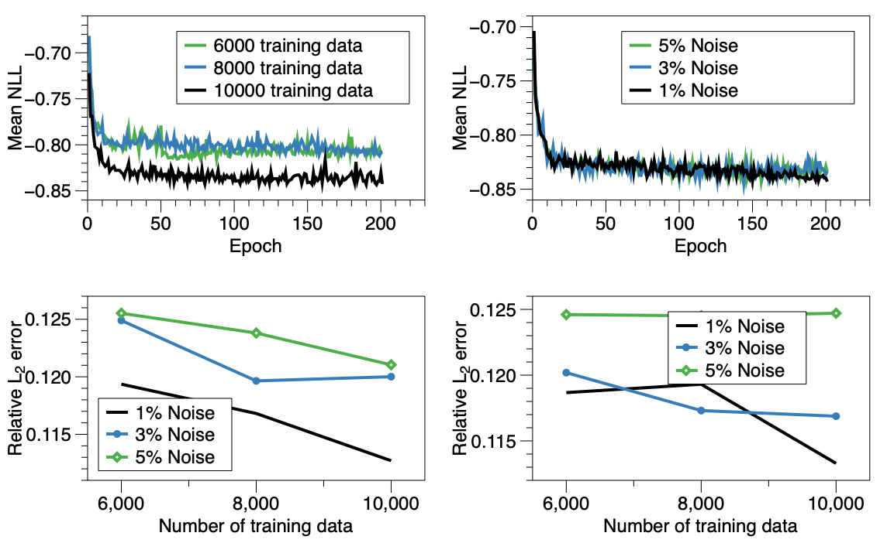

# Solving inverse problems using conditional invertible neural networks.

Solving inverse problems using conditional invertible neural networks. [JCP](https://www.sciencedirect.com/science/article/pii/S0021999121000899#se0110) [ArXiv](https://arxiv.org/abs/2007.15849)

Govinda Anantha Padmanabha, [Nicholas Zabaras](https://www.zabaras.com/)

PaddlePaddle Implementation of Solving inverse problems using conditional invertible neural networks.

## 1. Introduction

### Highlights
* Rather than developing a surrogate for a forward model, we are training directly an inverse surrogate mapping output information of a physical system to an unknown input distributed parameter.
* A generative model based on conditional invertible neural networks (cINN) is developed.
* The cINN is trained to serve as an inverse surrogate model of physical systems governed by PDEs.
* The inverse surrogate model is used for the solution of inverse problems with unknown spatially-dependent parameters.
* The developed method is applied for the estimation of a non-Gaussian permeability field in multiphase flows using limited pressure and saturation data.

<p align="center">
 
</p>
<p align="center">
Mapping: observations &#8594 input space
 </p> 

<p align="center">
 
</p>
<p align="center">
Multiscale 2-D conditional invertible neural network
</p> 

<p align="center">
 
</p>
<p align="center">
Multiscale 3-D conditional invertible neural network
</p> 

### Results
<p align="center">
 
</p>
<p align="center">
2-D problem
</p> 

<p align="center">
 
</p>
<p align="center">
3-D problem
</p> 

<p align="center">
 
</p>
<p align="center">
2-D NLL and L2 metrics
</p> 

<p align="center">
 
</p>
<p align="center">
3-D NLL and L2 metrics
</p> 

## 2. Configuration and Run

### Datasets

Download the datasets from this link:
https://zenodo.org/record/4631233#.YFo8N-F7mDI

### Environment

```bash
conda create -n paddle_env python=3.8
conda install paddlepaddle==2.2.2
conda install scipy h5py matplotlib scikit-learn
```

### Run
modify the dataset path in `2D/utils/load_data.py` and `3D/utils/load_data.py`.

```bash
cd 2D # or cd 3D
python train.py
```

## 3. Reproduced Results
<p align="center">
 
</p>
<p align="center">
2-D Reproduced Results
</p> 

<p align="center">
 
</p>
<p align="center">
3-D Reproduced Results
</p> 

### 4. Code Structure

```
inn-surrogate-paddle
|-- 2D
|   |-- README.md
|   |-- args.py
|   |-- models
|   |   |-- CouplingBlock.py
|   |   |-- CouplingOneSide.py
|   |   |-- Divide_data_model.py
|   |   |-- Downsample_model.py
|   |   |-- Permute_data_model.py
|   |   |-- Unflat_data_model.py
|   |   |-- conditioning_network.py
|   |   |-- flat_data_model.py
|   |   `-- main_model.py
|   |-- train.py
|   `-- utils
|       |-- load_data.py
|       |-- plot.py
|       `-- plot_samples.py
|-- 3D
|   |-- README.md
|   |-- args.py
|   |-- models
|   |   |-- CouplingBlock_model.py
|   |   |-- CouplingOneSide_model.py
|   |   |-- Divide_data_model.py
|   |   |-- Downsample_model.py
|   |   |-- Permute_data_model.py
|   |   |-- Unflat_data_model.py
|   |   |-- conditioning_network.py
|   |   |-- flat_data_model.py
|   |   `-- main_model.py
|   |-- train.py
|   `-- utils
|       |-- error_bars.py
|       |-- load_data.py
|       `-- plot.py
`-- data
    |-- 2D_problem_dataset
    |   |-- Config_2_sample_obs_1pc.hdf5
    |   |-- Config_2_sample_obs_3pc.hdf5
    |   |-- Config_2_sample_obs_5pc.hdf5
    |   |-- Config_2_test_obs_1pc.hdf5
    |   |-- Config_2_test_obs_3pc.hdf5
    |   |-- Config_2_test_obs_5pc.hdf5
    |   |-- Config_2_train_obs_1pc.hdf5
    |   |-- Config_2_train_obs_3pc.hdf5
    |   `-- Config_2_train_obs_5pc.hdf5
    `-- 3D_problem_dataset
        |-- Config_2_sample_obs_1pc_3D.hdf5
        |-- Config_2_sample_obs_3pc_3D.hdf5
        |-- Config_2_sample_obs_5pc_3D.hdf5
        |-- Config_2_test_obs_1pc_3D.hdf5
        |-- Config_2_test_obs_3pc_3D.hdf5
        |-- Config_2_test_obs_5pc_3D.hdf5
        |-- Config_2_train_obs_1pc_3D.hdf5
        |-- Config_2_train_obs_3pc_3D.hdf5
        `-- Config_2_train_obs_5pc_3D.hdf5
```

### 5. Pre-trained models

### Acknowledgments
Thanks to authors publish [inn-surrogate](https://github.com/zabaras/inn-surrogate).

If you find this GitHub repository useful for your work, please consider to cite their work:  

@article{padmanabha2021solving,     
  title={Solving inverse problems using conditional invertible neural networks},     
  journal={Journal of Computational Physics},     
  pages={110194},     
  year={2021},     
  publisher={Elsevier}     
  doi = {https://doi.org/10.1016/j.jcp.2021.110194 },       
  url = {https://www.sciencedirect.com/science/article/pii/S0021999121000899},       
  author = {Govinda Anantha Padmanabha and Nicholas Zabaras}     
}
